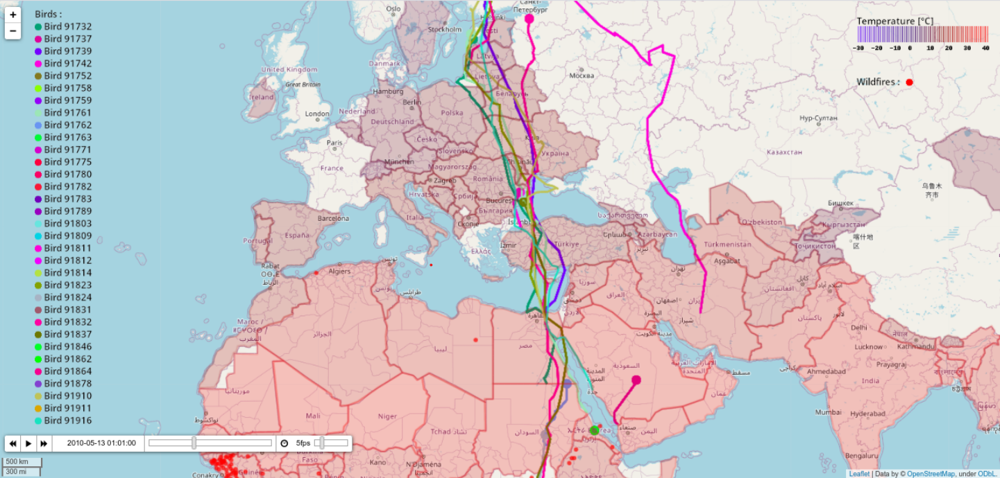

# GeoDataViz - Database Visualization on Maps (2020)

**Author:** Omar Roland Baumgärtner

**Supervised by:** Mr. Le Vaillant, Mr. Villee

GeoDataViz is a Python-based project developed in 2020 as a part of my first year of my Masters in computer science studies. It is aimed at processing various databases and visualizing them on maps, with a focus on two key factors: bird migration and wildfires.

## Project Overview

### Data Research

The project begins with an extensive search for relevant databases, emphasizing coherence, relevance, and reliability.

### Bird Migration

Bird migration data is sourced in CSV format from MoveBank[1], a database for tracking animals supervised by the Max Planck Institute of Ornithology in Bavaria, Germany. Specifically, the data comes from German ornithologist Martin Wikelski and includes tracking data for 33 marine seagulls over a 7-year period from 2009 to 2015. The data provides essential attributes: bird ID, position (longitude, latitude), and corresponding date.

### Wildfires

Wildfire data is retrieved from NASA[4], specifically from the FIRMS (Fire Information for Resource Management System), which provides fire-related information for resource management. These data are available in DBF format. NASA offers access to near-real-time or archived fire data, obtained through spectral radiometer imagery (MODIS) or visible and infrared radiometer imagery (VIIRS). In this project, MODIS data is used, comprising over 14 million wildfire records in Africa from 2010 to 2013.

To ensure data consistency, only data from the period between 2010 and 2013 is considered. For performance reasons, databases are cleaned by removing data outside this interval, reducing the program's processing time.

## Development

The project development proceeds through several stages, starting with the graphical user interface (GUI), followed by data processing, and concluding with data visualization on maps.

### GUI Development

The first step involves creating a GUI that allows users to select the desired time period (from 2010 to 2013) and the data to display. Tkinter, the original Python graphical library, is used to create the GUI.

### Map and Data Representation Development

For data processing, Pandas and GeoPandas libraries are employed to navigate CSV files and databases containing both standard and geospatial data. These data are then converted and returned in GeoJSON format.

GeoJSON is a data structure similar to:

Each data point is considered a "feature" characterized by its geometry (point, line, polygon), coordinates, and properties. Features are grouped into a common dictionary, the FeatureGroup, which is crucial as Folium, an interface between Python and the Leaflet JavaScript library, uses it to generate dynamic maps based on OpenStreetMap cartographic data. Folium also utilizes Bootstrap for data representation (icon design), enhancing aesthetics and ergonomics. It offers additional features such as zoom control, scale display, and mouse coordinates display. Pillow, the Python imaging library, is used to generate images for legends.

## Challenges Encountered

### Pre-Development Challenges

The initial difficulties included finding free, comprehensive, and reliable databases while maintaining consistency over the selected time period. Additionally, some databases used different coordinate systems, requiring either additional conversion libraries or a search for suitable alternatives.

### Development Challenges

During development, challenges arose with the Folium library. Some methods lacked documentation, and others were not yet fully functional, leading to extensive research on forums. For example, the feature to add legends was not yet available. The solution was to generate legends as images using the Pillow library and then add them to the map using a Folium method.

## Final Results

The project's interface allows users to select desired factors and time periods. The final visualizations include:

- Bird migration data with randomly assigned colors to each bird and a legend generated from these colors and their IDs for easy bird tracking.

- Wildfire data represented by simple red points.

Combining these two functionalities results in a comprehensive visualization of bird migration and wildfire data on maps.

## Additional Features

Future enhancements for the project may include the addition of a block diagram to explain its structure, the inclusion of screenshots to illustrate key points, and the possibility of adding a demonstration video.

## How to Use

To use GeoDataViz, follow these steps:

1. **Setting Up the Environment:**
    - Install Poetry if not already installed. Poetry is a tool for dependency management and packaging in Python.
    - Use Poetry to install the required libraries by running `poetry install` in your project directory.

2. **Running the Application:**
    - Run `main.py` using Python. This will launch the graphical user interface.
    - In the interface, select the desired period for visualization (between 2010 and 2013).
    - Choose the features you want to display on the map (bird migration data, wildfire data, or both).

3. **Viewing the Data:**
    - After making your selections, a web page will automatically open displaying a dynamic map.
    - This map visualizes the selected data through the specified time period.
    - You can interact with the map to explore different aspects of the visualized data.
